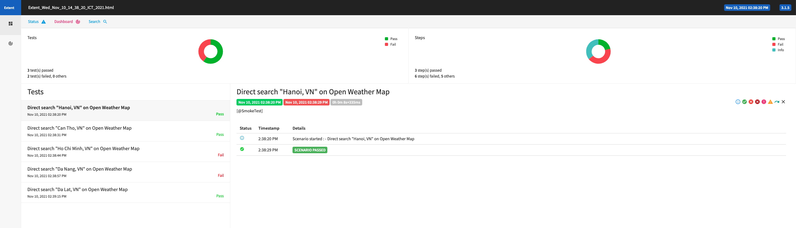

# WebAutomation

A sample Automation framework that using Selenium, Cucumber and Java to run a simple test case on the website https://openweathermap.org/ <br>

## Tools

* Maven
* Cucumber-JVM
* JUnit
* TestNG
* Selenium Webdriver
* Log4j
* Extent Report

## Requirements

In order to utilise this project we need to have the following installed locally:

* Maven
* Chrome browser version 95 (For the latest Chrome driver download at https://chromedriver.chromium.org/downloads)
* Firefox browser 94 (latest Gecko Driver: https://github.com/mozilla/geckodriver/releases)
* Fire fox
* Java 8

## How to run
Stand on the root folder, type command:<br>
* ```mvn clean test -DsuiteFile=testAutomation.xml```

This project is running on Chrome by default. To run Firefox, edit as below in /src/main/resources/frameworkconfig.properties
* ```test.configuration.browser=firefox```

## Report
After run the test, report will be generated in the folder ```reports```



## CI-CD Integration

### Integrate with GitHub

### Create PR

### Log

### Refer to
https://www.lambdatest.com/blog/selenium-github-actions-example/
